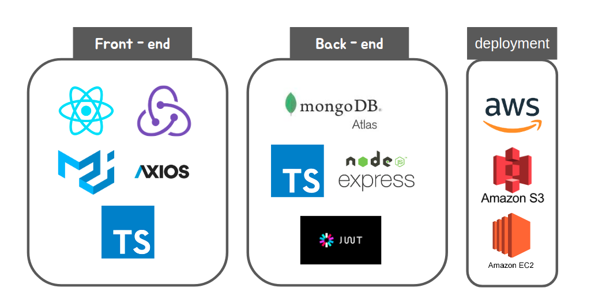
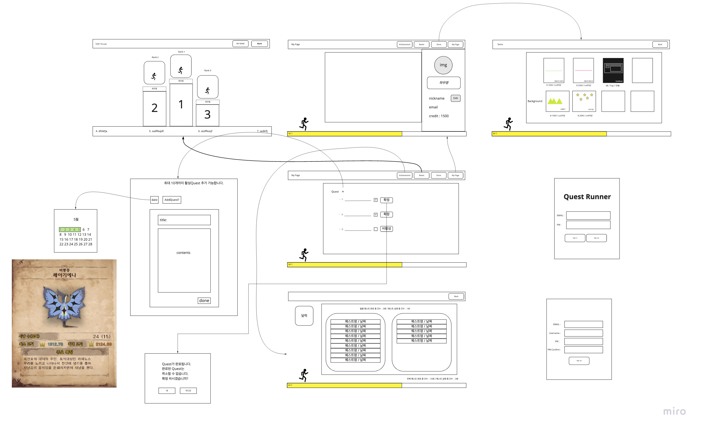
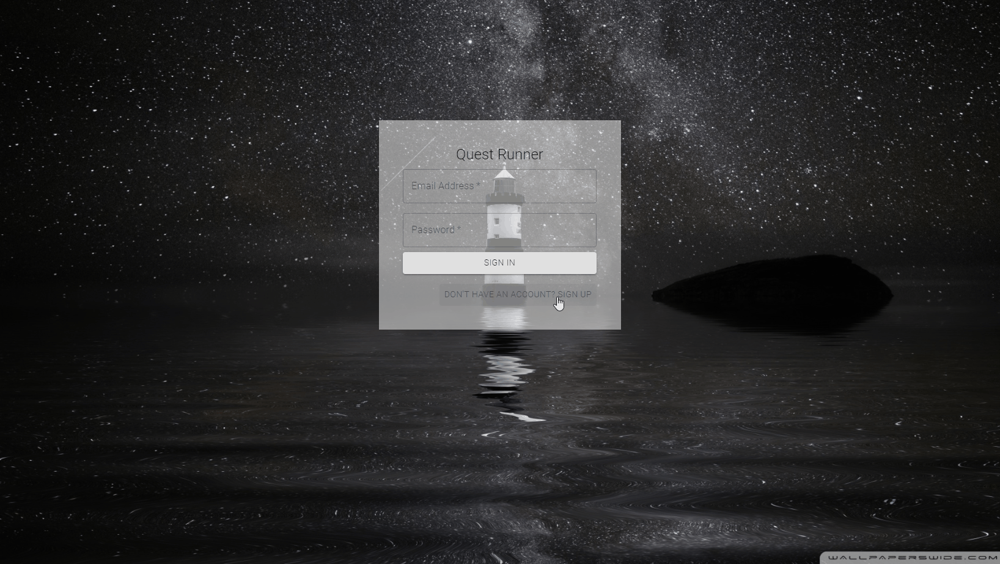
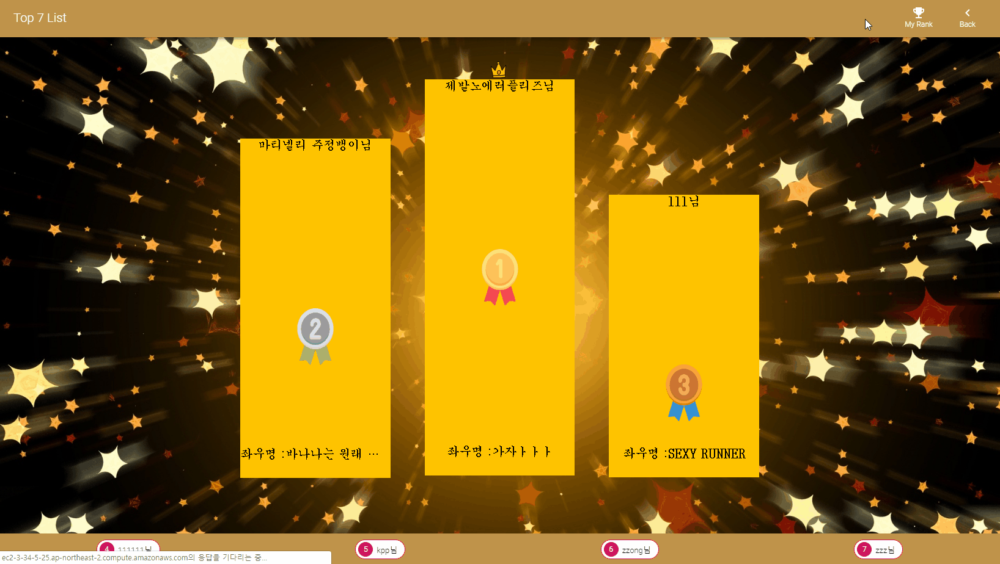

# QuestRunner
##### 기존의 목표만 가지고 있던 todolist의 진화형 버젼으로 게임의 레벨업 시스템을 도입하여 목표를 달성 할 시 레벨이 오르고 상점에서 물품을 구입하여 본인을 꾸밀 수 있는 todolist.

### Stacks & Architecture

### member
- 김산(team leader) : back-end, https://github.com/lambrosopos
- 김환(team member) : front-end, https://github.com/funetes
- 박윤아(team member) : front-end, https://github.com/yoonah1996
- 이종현(team member) : front-end, https://github.com/Jumpis

* * *

### Interface Structure

### Flow

### Demonstration

Sign Up & Sign In

Quest Register

Achievement

Rank

Store

Userinfo

Darkmode

바로가기 : [QuestRunner](https://go.aws/2LF8cnA)